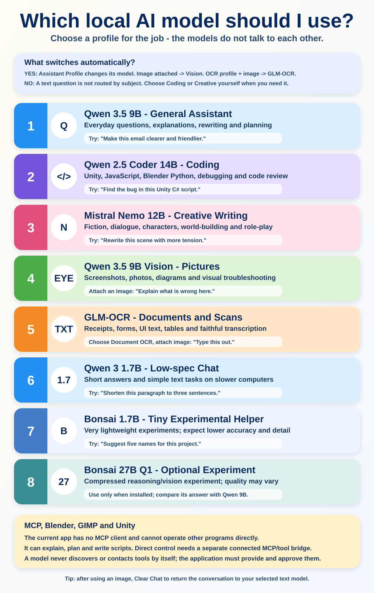

# Mellish Portable AI Assistant - simple user guide

## Start here

1. Run `Start Assistant.bat` and wait until **Ollama: ready** appears.
2. Choose an **Assistant Profile** in the Generation panel.
3. Type a message and press **Send**, or press `Ctrl+Enter`.
4. Use **Stop / Interrupt** to stop generation, speech or recording.
5. Conversations save automatically. Use **New Chat** to start another, and the
   **Chats** panel to reopen, rename or delete one.

## Which model should I use?

| Task | Recommended profile/model | What to expect |
|---|---|---|
| Everyday chat, explanations, rewriting and planning | **General Assistant / Qwen 3.5 9B** | Best default for ordinary text work. |
| Unity, JavaScript, Blender Python, debugging or code review | **Game Development and Coding / Qwen 2.5 Coder 14B** | Better code knowledge, but generally slower and heavier. |
| Fiction, dialogue, role-play and world-building | **Unrestricted Creative Writing / Mistral Nemo 12B** | Creative profile with thinking enabled and a larger context. |
| Screenshots, photographs and diagrams | **Qwen 3.5 9B Vision** | Attach an image; the app selects Vision automatically. |
| Receipts, forms, scans, UI text and tables | **Document OCR / GLM-OCR** | Select Document OCR and attach an image. |
| Short, simple work on slower hardware | **Qwen 3 1.7B** | Faster and lighter, with lower depth and accuracy. |
| Tiny-model experiments | **Bonsai 1.7B** | Extremely small; use for simple prompts only. |
| Compressed large-model experiment | **Bonsai 27B Q1** | Optional and experimental; compare important answers with Qwen. |

**BGE-M3 is not a chat model.** The application uses it automatically for
Project Knowledge searches when that feature is enabled.

## Does the application switch models automatically?

Partly:

- Selecting **General Assistant**, **Game Development and Coding**,
  **Unrestricted Creative Writing**, or **Document OCR** changes the model and
  its recommended generation settings.
- Attaching any image automatically uses Qwen Vision.
- If the Document OCR profile is selected, an attached image uses GLM-OCR.
- Once a conversation contains an image, later replies continue using the image
  model because the image remains in the conversation history. Use **New Chat**
  to return to the model shown in the model selector without erasing the old chat.
- Project Knowledge automatically calls BGE-M3 to find relevant local excerpts.

It does **not** inspect an ordinary text question and decide that it is coding,
creative writing or general chat. Select the appropriate profile yourself.

Only one chat model answers each request. The models do not hold a meeting,
delegate work to one another, or automatically check another model's answer.

## Profiles, models and system prompts

The **Assistant Profile** is the easiest way to switch jobs. It selects a model,
system prompt and sensible settings together. The model selector can also be
changed directly; doing that selects the matching profile when one exists.

**Edit System Prompt** changes how the selected profile behaves. The app keeps a
separate remembered prompt for each profile, so switching profile does not erase
the prompt you wrote for another profile. Choose **Custom** when you want to pick
a model and prompt without a predefined pairing.

## Images

Use **Attach Image** in Chat for image understanding. Ask a specific question,
such as "Explain this error", "Describe the visible character", or "Transcribe
this form". Images must be below 25 MB.

The current portable package analyses images; it does not include an image
generator. Attaching an image sends it to Vision or OCR, not to a text-to-image
system.

## Voice

- Hold **Hold to Talk**, speak, then release to transcribe locally.
- Enable **Auto-send transcript** if the transcription should be submitted
  immediately.
- Enable **Read replies aloud** for automatic local TTS.
- Choose a voice and speed in the Voice panel.
- **Stop Speaking** or **Stop / Interrupt** stops playback.

Microphone permission and the selected Windows input device remain
machine-specific after copying the assistant to another PC.

## Project Knowledge

Project Knowledge can index a local project folder and add relevant excerpts to
ordinary chat requests. It is useful for source code, notes and documentation.
Choose the folder, build the index, then enable **Use project knowledge**.

The index helps the active chat model answer from local evidence, but it does
not edit files or run the project. Rebuild the index after major project changes.

## MCP and controlling other applications

The application includes an MCP client for `stdio` and Streamable HTTP servers.
Open **MCP Tools**, enable tool use, configure the required bridge, and press
**Refresh Tools**. Discovered tool schemas are supplied to Ollama and every
individual call requires confirmation.

Blender, GIMP and Unity still require a matching plug-in/add-on inside the
target application. Unity's portable Python bridge installs with Mellish; its
Unity Editor package is still required. Blender and GIMP connectors stay
separate because host versions and security models differ.

Use **Game Development and Coding** first for programming-oriented tool work.
Local models can select the wrong tool or produce malformed arguments, so check
the approval dialog, keep backups/source control, and verify the result in the
target app. See [MCP_SETUP.md](MCP_SETUP.md) for setup and security limitations.

## Chats and automatic history

- **New Chat** starts a clean conversation without deleting earlier work.
- The **Chats** panel lists saved conversations newest first.
- Double-click a chat, or select it and press **Open**, to continue it.
- Titles come from the first user message and can be renamed.
- Chats auto-save after user messages, replies and tool results; the last active
  chat is restored after restart.
- **Save Chat** and **Load Chat** remain available for JSON export/import.

## Generation controls

- **Temperature:** lower values are steadier; higher values are more varied.
- **Context:** how much conversation/project text can be considered. Larger
  values use more memory and can reduce speed.
- **No Think:** requests a shorter direct Qwen response. Turn it off for harder
  reasoning when time and hardware allow.
- **Model selector:** manual override. A text request will stay on this model
  until a profile, model, or image-routing rule changes it.

## If something looks wrong

- Check the component status row first.
- Press **Refresh** if installed models are missing from the list.
- Run `Run Diagnostics.bat` for component checks.
- Run `Repair or Add Models.bat` to repair packages or add a model without
  choosing a different installation folder.
- Use the Console launcher if the normal launcher closes unexpectedly.

